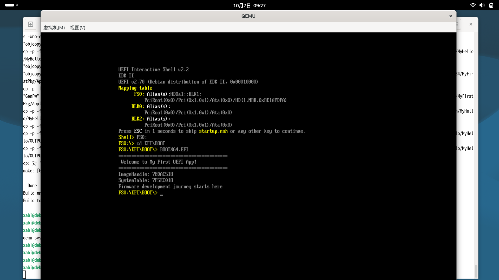
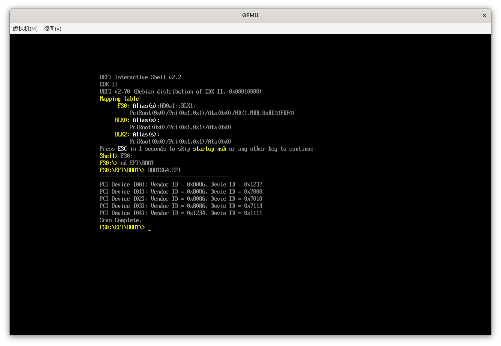

# UEFI Learning Journey

My hands-on journey from zero to UEFI firmware development on Debian Linux.

## Goal

Transitioning from laptop hardware sales to firmware/BIOS engineering. This
repo documents my daily progress, experiments and lessons learned.

## Environment

- **Host OS**: Debian 13(x86_64)
- **Firmware**: EDK II (upstream+OVMF)
- **Emulator**: QEMU with KVM -**Toolchain**: GCC (with `\-t GCC` flag )

## Directory structure

- `MyFirstPkg/` \-- My first custom UEFI application package.

## Day 1: Hello World from Scratch (2026-10-07)

### What I did today

1.  Created a custom UEFI application package (`MyFirstPkg`) from scratch,
    including `.c`, `.inf`, and `.dsc` files.
2.  Ran into **multiple  dependency resolulation errors** (error 4000) and fixed
    them one by one.
3.  compiled the app successfully and booted it in QEMU, printing real pointer
    values.

### Key Lessons Learned (whack-a-mole phase)

EDK II require **explicit declaration** of every single library in the `.dsc`
file. It does NOT auto-resolve like Windows Visual Studio. The following
libraries were added to the `\[LibraryClasses]`
 section:
 | Library Class | Whyit was Needed  | 
|---|---| 
| `UefiApplicationEntryPoint` | Provides the `UefiMain`entry point | 
| `UefiLib`|Provides `Print()` | `PrintLib`|String formatting |
| `RegisterFilterLib` | New security requirement for `PrintLib` |
| `PcdLib` |Required by `UefiLib` |
| `MemoryAllocationLib` | Required by `UefiLib` |
| `UefiBootServicesTableLib` | Provides `gBS` and `gST` pointers |
| `UefiRuntimeServicesTableLib` | Provides `gRT` pointer |
| `BaseLib` / `BaseMemoryLib` | Core Primitives |
| `DebugLib` / `DebugPrintErrorLevelLib` | Debug output |
| `DevicePathLib` | Required by `UefiLib` |
| `StackCheckLib` / `StackCheckFailureHookLib` | New stack Protection (use Null implementation) |

### Common Pitfall

- `#include <Library/Uefi.h>` is **wrong**. It should be `#include <Uefi.h>`
  (no `Library/` prefix).

## How to Build and Run

```bash
### 1.Set up EDK II envronment
cd ~/src/edk2
source edksetup.sh

### 2. Copy this package into the EDK II worspace
cp -r ~/uefi-learning-journey/MyFirstPkg .

### 3. Build
build -a X64 -t GCC -p MyFirstPkg/MyFirstPkg.dsc

### 4.Prepare ESP
mkdir -p /tmp/uefi_esp/EFI/BOOT
cp Build/MyFirstPkg/DEBUG_GCC/X64/MyHello.efi /tmp/uefi_esp/EFI/BOOT/BOOTX64.EFI

### 5.Run in QEMU
qemu-system-x86_64 -enable-kvm -m 2048 -bios /usr/share/ovmf/OVMF.fd -drive file=fat:rw:/tmp/uefi_esp,format=raw -net none


Screenshot



## Day 2: Update PCI Enumeration Works! (2026-10-09)

Successfuly built and ran my custom `PciScan.efi` in QEMU. The application uses the `EFI_PCI_IO_PROTOCOL` to read the configuration space of all PCI devices.

Output in QEMU UEFI Shell:
- `0x8086:0x1237` (Intel Host Bridge)
- `0x8086:0x7000` (Intel ISA Bridge)
- `0x8086:0x7010` (Intel IDE Controller)
- `0x8086:0x7113` (Intel ACPI Controller)
- `0x1234:0x1111` (QEMU Virtual VGA)

This proves  I understand:
1. How to locate handles by protocol (`LocateHandleBuffer`).
2. How to open a protocol (`OpenProtocol`) on a handle.
3. How to invoke function pointers inside a protocol structure (`PciIo->Pci.Read`).
4. How PCI enumeration works at the firmware level.


Day 2 Screenshot



